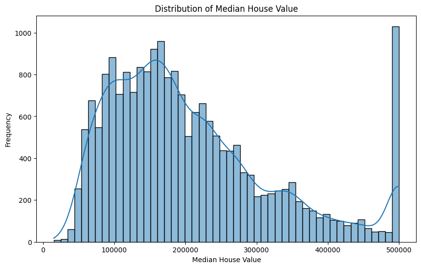
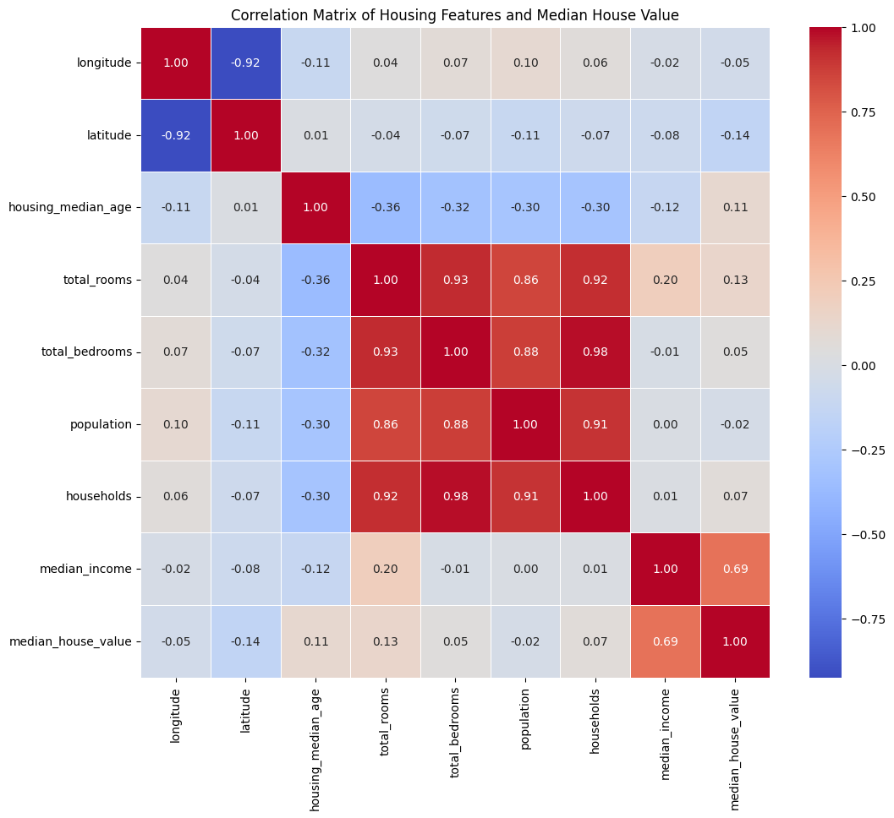
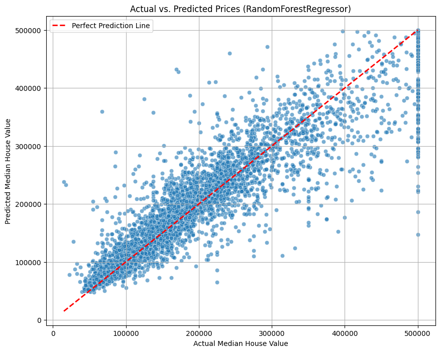
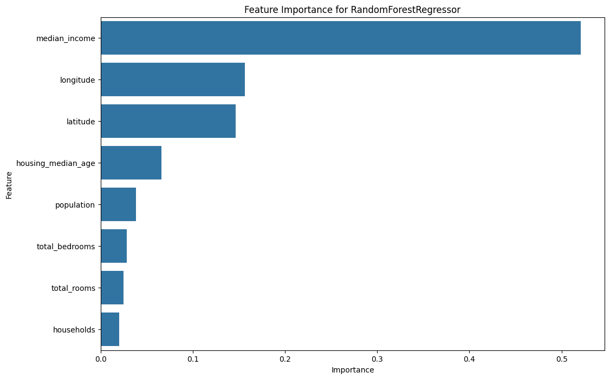

# HOUTATE SAÏD

**Numéro d'étudiant** : 24010355  
**Classe** : CAC2

 

---

# Compte rendu
## Prédiction des prix de l’immobilier résidentiel par régression supervisée

**Date :** 03 Décembre 2025

---

# Introduction :

Le marché immobilier joue un rôle central dans l’économie, car il influence à la fois la richesse des ménages, les décisions d’investissement et les politiques publiques. Dans ce contexte, disposer d’outils fiables pour estimer le prix des logements est essentiel pour les vendeurs, les acheteurs et les investisseurs. Le jeu de données « USA House Prices », issu de transactions réalisées aux États‑Unis, rassemble diverses caractéristiques des maisons (surface, nombre de chambres, localisation, etc.) ainsi que leur prix de vente.

L’objectif de ce travail est de développer et comparer plusieurs modèles de régression afin de prédire le prix des maisons à partir de leurs caractéristiques, et d’identifier les facteurs qui influencent le plus la valeur immobilière. Cette approche s’inscrit dans une logique de valorisation d’actifs immobiliers et d’aide à la décision sur le marché résidentiel.

# À propos de ce jeux de données :

Le jeu de données utilisé, `housing.csv`, provient d’une étude sur le marché immobilier en Californie. Chaque ligne représente un district géographique et décrit à la fois ses caractéristiques démographiques et immobilières.

- Nombre d’observations (N) : 20 640 districts environ  
- Nombre de variables (d) : 10 colonnes (9 features + 1 cible)  

# Problématique :

**Comment prédire le prix de vente d'une maison à partir de ses attributs physiques et contextuels ?**

# Objectif :

Développer des modèles de régression comparatifs pour minimiser l'erreur prédictive (RMSE) et identifier les facteurs clés de valorisation immobilière.

---

# Variables principales :  

- `median_house_value` : valeur médiane des maisons (cible, en dollars)  
- `median_income` : revenu médian des ménages  
- `housing_median_age` : âge médian des logements  
- `total_rooms`, `total_bedrooms` : nombre total de pièces / chambres  
- `population`, `households` : population et nombre de ménages  
- `latitude`, `longitude` : coordonnées géographiques  
- `ocean_proximity` : proximité de l’océan (catégorielle, non utilisée ici)

---

## Table des matières

1. [Introduction et problématique](#1-introduction-et-problématique)  
2. [Analyse exploratoire des données (EDA)](#2-analyse-exploratoire-des-données-eda)  
   * [Structure et cible](#21-structure-et-cible)  
   * [Distribution et corrélations](#22-distribution-et-corrélations)  
3. [Prétraitement des données](#3-prétraitement-des-données)  
   * [Séparation Train/Test](#31-séparation-traintest)  
   * [Imputation et standardisation](#32-imputation-et-standardisation)  
4. [Méthodologie de modélisation](#4-méthodologie-de-modélisation)  
   * [Modèles de régression testés](#41-modèles-de-régression-testés)  
   * [Stratégie d’évaluation](#42-stratégie-dévaluation)  
5. [Résultats et comparaison des modèles](#5-résultats-et-comparaison-des-modèles)  
6. [Analyse des résultats et interprétation](#6-analyse-des-résultats-et-interprétation)  
7. [Conclusion et perspectives](#7-conclusion-et-perspectives)

---

## 1. Introduction et problématique

Le marché immobilier californien est fortement influencé par des facteurs économiques (revenus, densité de population), géographiques (proximité de la côte, latitude/longitude) et démographiques. Pouvoir prédire de manière fiable la **valeur médiane des maisons** à partir de ces caractéristiques est essentiel pour les acteurs économiques (investisseurs, promoteurs, pouvoirs publics).

Problématique :  
Comment prédire la **valeur médiane des maisons (`median_house_value`)** à partir de caractéristiques socio‑économiques et géographiques, et quel type de modèle de régression fournit les meilleures performances prédictives ?

Objectifs :  
- Construire plusieurs modèles de **régression supervisée**.  
- Comparer leurs performances à l’aide des métriques **RMSE** et **\(R^2\)**.  
- Identifier les variables les plus influentes dans la détermination des prix.

---

## 2. Analyse exploratoire des données (EDA)

### 2.1 Structure et cible

Après chargement du fichier `housing.csv`, la structure suivante est observée :

- `median_house_value` définie comme variable cible  
- `ocean_proximity` étant catégorielle, seules les variables numériques sont retenues pour la modélisation initiale.  

Les features utilisées dans `X` sont donc, entre autres :  
`median_income`, `housing_median_age`, `total_rooms`, `total_bedrooms`, `population`, `households`, `latitude`, `longitude`.

### 2.2 Distribution et corrélations

- L’histogramme de `median_house_value` montre une distribution étalée, avec présence de valeurs élevées (queues à droite), ce qui traduit un marché hétérogène.

*(Figure 1 : Histogramme de la variable `median_house_value`)*

   
- La matrice de corrélation met en évidence :  
  - une forte corrélation positive entre `median_house_value` et `median_income`,  
  - une importance notable des coordonnées `latitude` et `longitude`,  
  - des corrélations plus faibles pour `total_rooms`, `total_bedrooms`, etc.

 *(Figure 2 : Matrice de corrélation des variables explicatives et de la cible)*  

Ces premiers résultats confirment le rôle majeur du **revenu médian** et de la **localisation** dans la formation des prix.

---

## 3. Prétraitement des données

### 3.1 Séparation Train/Test

Les données sont séparées en deux ensembles :

- Entraînement : 80 %  
- Test : 20 %  

Cette séparation permet d’évaluer de manière honnête la capacité de généralisation des modèles.

### 3.2 Imputation et standardisation

- Les éventuelles valeurs manquantes des features numériques sont traitées via une **imputation par la médiane** (SimpleImputer).  
- Toutes les variables explicatives sont ensuite **standardisées** (StandardScaler) afin de donner un ordre de grandeur comparable aux différentes features, ce qui est particulièrement important pour certains modèles (Ridge, Lasso, Gradient Boosting).

Les matrices finales `X_train_scaled` et `X_test_scaled` sont prêtes pour l’entraînement des modèles.

---

## 4. Méthodologie de modélisation

### 4.1 Modèles de régression testés

Plusieurs modèles de régression supervisée ont été comparés :

1. Régression linéaire  
2. Régression Ridge  
3. Régression Lasso  
4. RandomForestRegressor  
5. GradientBoostingRegressor  

Chaque modèle est entraîné sur `X_train_scaled`, `y_train`, puis évalué sur `X_test_scaled`, `y_test`.

### 4.2 Stratégie d’évaluation

Deux métriques sont utilisées :

- **RMSE (Root Mean Squared Error)** : erreur moyenne en unités de la cible (dollars), plus elle est faible, mieux c’est.  
- **\(R^2\) (coefficient de détermination)** : proportion de variance expliquée (comprise entre 0 et 1, plus proche de 1 = mieux).

Un tableau récapitulatif est construit à partir d’une liste `results` contenant les performances de chaque modèle.

---

## 5. Résultats et comparaison des modèles

Les résultats (valeurs issues de l’analyse) montrent :

- Les modèles **linéaires** (Régression linéaire, Ridge, Lasso) obtiennent des performances similaires, avec un \(R^2\) autour de 0.61 et une RMSE d’environ 71 000 dollars, traduisant une capacité limitée à capturer la complexité du marché immobilier.  
- Le **GradientBoostingRegressor** améliore nettement ces scores, avec un \(R^2\) proche de 0.76 et une RMSE d’environ 55 700 dollars, grâce à sa capacité à modéliser des relations non linéaires.  
- Le **RandomForestRegressor** est le meilleur modèle :  
  - \(R^2 \approx 0.81\)  
  - RMSE \(\approx 49 876\) dollars  

*(Figure 3 : Nuage de points `y_test` vs `y_pred` pour le meilleur modèle)*  

Une figure `y_test` vs `y_pred` pour le meilleur modèle montre que les points se concentrent autour de la diagonale, indiquant de bonnes prédictions, même si quelques écarts subsistent pour les valeurs extrêmes.

---

## 6. Analyse des résultats et interprétation

### 6.1 Pourquoi RandomForestRegressor est le meilleur

Le **RandomForestRegressor** surpasse les modèles linéaires et le Gradient Boosting pour plusieurs raisons :

- Il capture naturellement les **relations non linéaires** et les **interactions** entre variables (ex. effet combiné du revenu, de la localisation et de l’âge des logements).  
- En combinant de nombreux arbres construits sur des sous‑échantillons, il réduit la **variance** tout en gardant une bonne capacité prédictive.  
- Il est robuste aux valeurs extrêmes et aux distributions hétérogènes.

### 6.2 Importance des variables

L’analyse de `feature_importances_` du RandomForest met en avant :

1. `median_income` : principale variable explicative, confirmant que le niveau de revenu est un déterminant majeur du prix des maisons.  
2. `longitude` et `latitude` : variables de localisation essentielles, capturant la proximité de la côte, des grandes villes, etc.  
3. Autres variables (âge des logements, population, pièces, ménages) contribuent aussi, mais de manière moins dominante.

*(Figure 4 : Importance des variables pour le modèle RandomForestRegressor)*  

Ces résultats sont cohérents avec l’intuition économique : **pouvoir d’achat + localisation** expliquent l’essentiel des variations de prix.

---

## 7. Conclusion et perspectives

Cette étude sur le jeu de données `housing.csv` a montré que :

- Le marché immobilier californien présente des **relations non linéaires** entre les caractéristiques des districts et la valeur médiane des maisons.  
- Les **modèles linéaires** sont insuffisants (environ 61 % de variance expliquée), tandis que les modèles à base d’arbres, en particulier le **RandomForestRegressor**, atteignent un niveau de performance élevé (\(R^2 \approx 0.81\)).  
- Les variables les plus déterminantes sont le **revenu médian** et la **localisation géographique**, ce qui confirme la forte dépendance des prix à la fois à la capacité financière des ménages et à l’attractivité des zones.

Perspectives d’amélioration :

- Intégrer et encoder correctement la variable catégorielle `ocean_proximity`.  
- Effectuer une **optimisation fine des hyperparamètres** (GridSearchCV/RandomizedSearchCV) pour le RandomForest et le Gradient Boosting.  
- Tester des modèles d’ensemble plus avancés (XGBoost, LightGBM) et des techniques d’ingénierie de features supplémentaires (ratios, transformations log, etc.).

En conclusion, la **régression supervisée par RandomForest** constitue une approche fiable pour prédire les prix des maisons dans ce dataset, tout en offrant une interprétation claire des variables clés qui structurent le marché immobilier californien.

